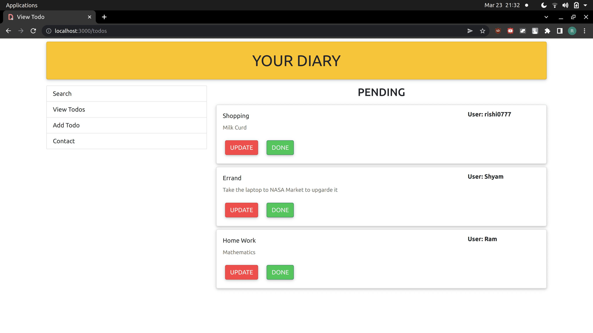
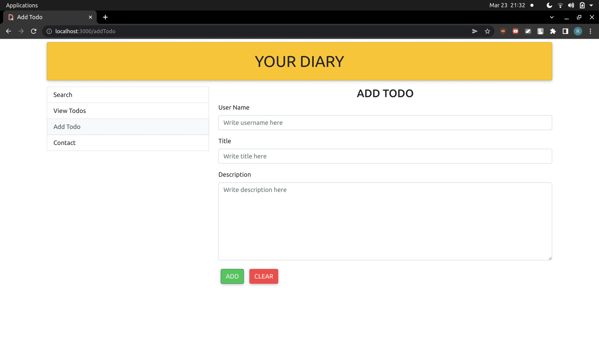
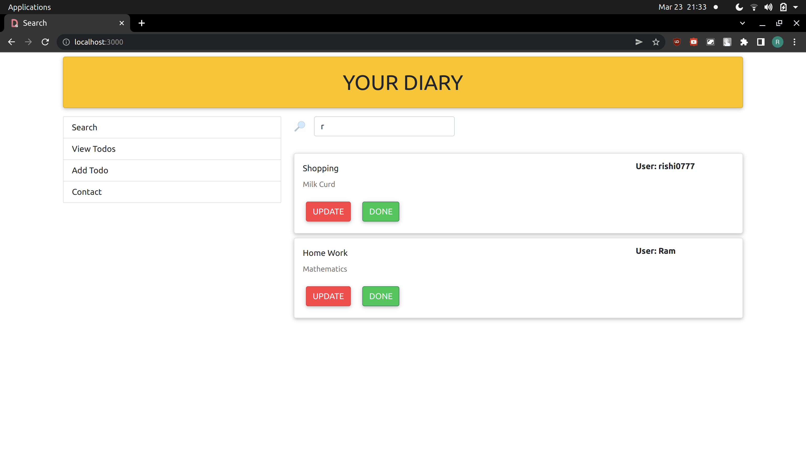

# Diary Application

• Created a website diary using which user can very easily keep track of their day to day ’s work. 
• Users can visit the website and create the todos when required they can can also update them and once completed they
can delete them. 
• Used MySql database to keep track of all todos, React js for front-end and Spring Boot for back-end. 
• It also provides real time searching that is as soon as user types anything in the search-box the data that matches to the content gets rendered on the screen

## Screenshots

 

 

 

